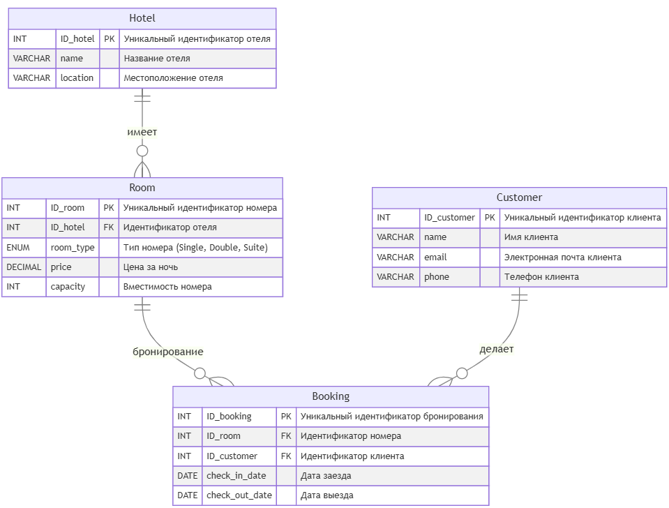

Ниже приводятся ответы в том же формате, что и предыдущие. Сначала краткое описание структуры базы и скриптов создания (MySQL/PostgreSQL), затем скрипты вставки тестовых данных, и наконец решения **каждой задачи одним SQL-запросом** (через подзапросы или похожие приёмы). При желании эти же решения можно упростить с помощью CTE в PostgreSQL.

---

## 1. Структура базы данных

### 1.1 Схема таблиц



- **Hotel**: Содержит информацию об отелях (ID, название, локация).
- **Room**: Номера отелей, указывают на `Hotel.ID_hotel`; поля цена, вместимость, тип номера.
- **Customer**: Клиенты (ID, имя, email, телефон).
- **Booking**: Бронирования, связывает `Room` и `Customer`; также содержит даты заезда/выезда.

### 1.2 Скрипты создания таблиц

#### **MySQL**

```sql
-- Создание таблицы Hotel
CREATE TABLE Hotel (
    ID_hotel INT PRIMARY KEY,
    name VARCHAR(255) NOT NULL,
    location VARCHAR(255) NOT NULL
);

-- Создание таблицы Room
CREATE TABLE Room (
    ID_room INT PRIMARY KEY,
    ID_hotel INT,
    room_type ENUM('Single', 'Double', 'Suite') NOT NULL,
    price DECIMAL(10, 2) NOT NULL,
    capacity INT NOT NULL,
    FOREIGN KEY (ID_hotel) REFERENCES Hotel(ID_hotel)
);

-- Создание таблицы Customer
CREATE TABLE Customer (
    ID_customer INT PRIMARY KEY,
    name VARCHAR(255) NOT NULL,
    email VARCHAR(255) UNIQUE NOT NULL,
    phone VARCHAR(20) NOT NULL
);

-- Создание таблицы Booking
CREATE TABLE Booking (
    ID_booking INT PRIMARY KEY,
    ID_room INT,
    ID_customer INT,
    check_in_date DATE NOT NULL,
    check_out_date DATE NOT NULL,
    FOREIGN KEY (ID_room) REFERENCES Room(ID_room),
    FOREIGN KEY (ID_customer) REFERENCES Customer(ID_customer)
);
```

#### **PostgreSQL**

```sql
-- Создание таблицы Hotel
CREATE TABLE Hotel (
    ID_hotel SERIAL PRIMARY KEY,
    name VARCHAR(255) NOT NULL,
    location VARCHAR(255) NOT NULL
);

-- Создание таблицы Room
CREATE TABLE Room (
    ID_room SERIAL PRIMARY KEY,
    ID_hotel INT,
    room_type VARCHAR(20) NOT NULL CHECK (room_type IN ('Single', 'Double', 'Suite')),
    price DECIMAL(10, 2) NOT NULL,
    capacity INT NOT NULL,
    FOREIGN KEY (ID_hotel) REFERENCES Hotel(ID_hotel)
);

-- Создание таблицы Customer
CREATE TABLE Customer (
    ID_customer SERIAL PRIMARY KEY,
    name VARCHAR(255) NOT NULL,
    email VARCHAR(255) UNIQUE NOT NULL,
    phone VARCHAR(20) NOT NULL
);

-- Создание таблицы Booking
CREATE TABLE Booking (
    ID_booking SERIAL PRIMARY KEY,
    ID_room INT,
    ID_customer INT,
    check_in_date DATE NOT NULL,
    check_out_date DATE NOT NULL,
    FOREIGN KEY (ID_room) REFERENCES Room(ID_room),
    FOREIGN KEY (ID_customer) REFERENCES Customer(ID_customer)
);
```

---

## 2. Наполнение базы тестовыми данными

```sql
-- Вставка данных в таблицу Hotel
INSERT INTO Hotel (ID_hotel, name, location) VALUES
(1, 'Grand Hotel', 'Paris, France'),
(2, 'Ocean View Resort', 'Miami, USA'),
(3, 'Mountain Retreat', 'Aspen, USA'),
(4, 'City Center Inn', 'New York, USA'),
(5, 'Desert Oasis', 'Las Vegas, USA'),
(6, 'Lakeside Lodge', 'Lake Tahoe, USA'),
(7, 'Historic Castle', 'Edinburgh, Scotland'),
(8, 'Tropical Paradise', 'Bali, Indonesia'),
(9, 'Business Suites', 'Tokyo, Japan'),
(10, 'Eco-Friendly Hotel', 'Copenhagen, Denmark');

-- Вставка данных в таблицу Room
INSERT INTO Room (ID_room, ID_hotel, room_type, price, capacity) VALUES
(1, 1, 'Single', 150.00, 1),
(2, 1, 'Double', 200.00, 2),
(3, 1, 'Suite', 350.00, 4),
(4, 2, 'Single', 120.00, 1),
(5, 2, 'Double', 180.00, 2),
(6, 2, 'Suite', 300.00, 4),
(7, 3, 'Double', 250.00, 2),
(8, 3, 'Suite', 400.00, 4),
(9, 4, 'Single', 100.00, 1),
(10, 4, 'Double', 150.00, 2),
(11, 5, 'Single', 90.00, 1),
(12, 5, 'Double', 140.00, 2),
(13, 6, 'Suite', 280.00, 4),
(14, 7, 'Double', 220.00, 2),
(15, 8, 'Single', 130.00, 1),
(16, 8, 'Double', 190.00, 2),
(17, 9, 'Suite', 360.00, 4),
(18, 10, 'Single', 110.00, 1),
(19, 10, 'Double', 160.00, 2);

-- Вставка данных в таблицу Customer
INSERT INTO Customer (ID_customer, name, email, phone) VALUES
(1, 'John Doe', 'john.doe@example.com', '+1234567890'),
(2, 'Jane Smith', 'jane.smith@example.com', '+0987654321'),
(3, 'Alice Johnson', 'alice.johnson@example.com', '+1122334455'),
(4, 'Bob Brown', 'bob.brown@example.com', '+2233445566'),
(5, 'Charlie White', 'charlie.white@example.com', '+3344556677'),
(6, 'Diana Prince', 'diana.prince@example.com', '+4455667788'),
(7, 'Ethan Hunt', 'ethan.hunt@example.com', '+5566778899'),
(8, 'Fiona Apple', 'fiona.apple@example.com', '+6677889900'),
(9, 'George Washington', 'george.washington@example.com', '+7788990011'),
(10, 'Hannah Montana', 'hannah.montana@example.com', '+8899001122');

-- Вставка данных в таблицу Booking
INSERT INTO Booking (ID_booking, ID_room, ID_customer, check_in_date, check_out_date) VALUES
(1, 1, 1, '2025-05-01', '2025-05-05'),   -- John Doe  @Grand Hotel (room 1)
(2, 2, 2, '2025-05-02', '2025-05-06'),   -- Jane Smith @Grand Hotel (room 2)
(3, 3, 3, '2025-05-03', '2025-05-07'),   -- Alice Johnson @Grand Hotel (room 3)
(4, 4, 4, '2025-05-04', '2025-05-08'),   -- Bob Brown   @Ocean View (room 4)
(5, 5, 5, '2025-05-05', '2025-05-09'),   -- Charlie W.  @Ocean View (room 5)
(6, 6, 6, '2025-05-06', '2025-05-10'),   -- Diana P.    @Ocean View (room 6)
(7, 7, 7, '2025-05-07', '2025-05-11'),   -- Ethan Hunt  @Mountain Retreat (room 7)
(8, 8, 8, '2025-05-08', '2025-05-12'),   -- Fiona Apple @Mountain Retreat (room 8)
(9, 9, 9, '2025-05-09', '2025-05-13'),   -- George W.   @City Center (room 9)
(10, 10, 10, '2025-05-10', '2025-05-14'), -- Hannah M.  @City Center (room 10)

(11, 1, 2, '2025-05-11', '2025-05-15'),  -- Jane Smith @Grand Hotel again
(12, 2, 3, '2025-05-12', '2025-05-14'),  -- Alice Johnson 2 nights @Grand Hotel
(13, 3, 4, '2025-05-13', '2025-05-15'),  -- Bob Brown 2 nights  @Grand Hotel (room 3)
(14, 4, 5, '2025-05-14', '2025-05-16'),  -- Charlie W. 2 nights @Ocean View
(15, 5, 6, '2025-05-15', '2025-05-16'),  -- Diana P.   1 night   @Ocean View
(16, 6, 7, '2025-05-16', '2025-05-18'),  -- Ethan H.   2 nights  @Ocean View
(17, 7, 8, '2025-05-17', '2025-05-21'),  -- Fiona A.   4 nights  @Mountain Retreat
(18, 8, 9, '2025-05-18', '2025-05-19'),  -- George W.  1 night   @Mountain Retreat
(19, 9, 10, '2025-05-19', '2025-05-22'), -- Hannah M. 3 nights  @City Center
(20, 10, 1, '2025-05-20', '2025-05-22'), -- John Doe   2 nights  @City Center

(21, 1, 2, '2025-05-21', '2025-05-23'),  -- Jane Smith 2 nights @Grand Hotel
(22, 2, 3, '2025-05-22', '2025-05-25'),  -- Alice Johnson 3 nights @Grand Hotel
(23, 3, 4, '2025-05-23', '2025-05-26'),  -- Bob Brown 3 nights   @Grand Hotel
(24, 4, 5, '2025-05-24', '2025-05-25'),  -- Charlie W. 1 night   @Ocean View
(25, 5, 6, '2025-05-25', '2025-05-27'),  -- Diana P.   2 nights  @Ocean View
(26, 6, 7, '2025-05-26', '2025-05-29');  -- Ethan H.   3 nights  @Ocean View
```

---

## 3. Задания

### Задача 1

**Условие:**
> Определить, какие клиенты сделали **более двух бронирований** в **разных** отелях.  
> Вывести:
> - Имя (name), email, телефон,
> - Общее число бронирований (total_bookings),
> - Список уникальных отелей, в которых они бронировали (через запятую),
> - Среднюю длительность их пребывания (в днях) по всем бронированиям (average_stay).  
    > Сортировка — по количеству бронирований **по убыванию**.

**Подсказки**
- Разные отели => `COUNT(DISTINCT Hotel.ID_hotel)` или `COUNT(DISTINCT h.ID_hotel) >= 2`.
- Более двух бронирований => `COUNT(*) > 2`.
- Средняя длительность = `AVG(DATEDIFF(check_out_date, check_in_date))`.
- Список отелей можно собрать с помощью `GROUP_CONCAT(DISTINCT Hotel.name)` (MySQL) или `string_agg` (PostgreSQL).

**Пример (MySQL)**

```sql
SELECT
  c.name AS customer_name,
  c.email,
  c.phone,
  COUNT(*) AS total_bookings,
  GROUP_CONCAT(DISTINCT h.name ORDER BY h.name SEPARATOR ', ') AS hotels_list,
  ROUND(AVG(DATEDIFF(b.check_out_date, b.check_in_date)), 4) AS average_stay
FROM Booking b
JOIN Customer c ON c.ID_customer = b.ID_customer
JOIN Room r ON r.ID_room = b.ID_room
JOIN Hotel h ON h.ID_hotel = r.ID_hotel
GROUP BY c.ID_customer
HAVING 
  COUNT(*) > 2
  AND COUNT(DISTINCT h.ID_hotel) >= 2
ORDER BY total_bookings DESC;
```

**Ожидаемый вывод** (по тестовым данным):
```
customer_name   email                   phone         total_bookings   hotels_list                         average_stay
-------------   ----------------------  -----------   --------------   ----------------------------------  ------------
Bob Brown       bob.brown@example.com   +2233445566   3                Grand Hotel, Ocean View Resort      3.0000
Ethan Hunt      ethan.hunt@example.com  +5566778899   3                Mountain Retreat, Ocean View Resort 3.0000
```

---

### Задача 2

**Условие:**
> Провести анализ клиентов, которые:
>
> 1) Сделали **более двух бронирований** и **бронировали номера в более чем одном отеле**.
     >    - Вывести: `ID_customer`, `name`, `total_bookings`, `unique_hotels`, `total_spent` (сумма, потраченная на бронирования).
>
> 2) Потратили **более 500 долларов** на бронирования.
     >    - Вывести: `ID_customer`, `name`, `total_spent`, `total_bookings`.
>
> Объединить эти два набора данных (то есть получить клиентов, удовлетворя **обоим** критериям).
>
> Итоговый вывод: `ID_customer, name, total_bookings, total_spent, unique_hotels`.  
> Отсортировать по `total_spent` (возрастание).

**Ключевой момент**: Нужно посчитать `total_spent`. Предположим, затраты = суммарная стоимость ночей, то есть `(DATEDIFF(check_out_date, check_in_date)) * price`.

**Пример (MySQL)**  
Для наглядности сделаем всё одним запросом, объединив логику:

```sql
SELECT
  t1.ID_customer,
  t1.name,
  t1.total_bookings,
  t1.total_spent,
  t1.unique_hotels
FROM
(
  /* "t1" - клиенты, у которых bookings>2, отелей>1, посчитан total_spent */
  SELECT
    c.ID_customer,
    c.name,
    COUNT(*) AS total_bookings,
    COUNT(DISTINCT h.ID_hotel) AS unique_hotels,
    SUM(DATEDIFF(b.check_out_date, b.check_in_date) * r.price) AS total_spent
  FROM Booking b
    JOIN Room r ON r.ID_room = b.ID_room
    JOIN Hotel h ON h.ID_hotel = r.ID_hotel
    JOIN Customer c ON c.ID_customer = b.ID_customer
  GROUP BY c.ID_customer, c.name
  HAVING COUNT(*) > 2
     AND COUNT(DISTINCT h.ID_hotel) > 1
) AS t1
JOIN
(
  /* "t2" - клиенты, у которых total_spent>500 (и считаем total_bookings заодно) */
  SELECT
    c.ID_customer,
    c.name,
    SUM(DATEDIFF(b.check_out_date, b.check_in_date) * r.price) AS total_spent,
    COUNT(*) AS total_bookings
  FROM Booking b
    JOIN Room r ON r.ID_room = b.ID_room
    JOIN Customer c ON c.ID_customer = b.ID_customer
  GROUP BY c.ID_customer, c.name
  HAVING SUM(DATEDIFF(b.check_out_date, b.check_in_date) * r.price) > 500
) AS t2
  ON t1.ID_customer = t2.ID_customer  -- пересечение: те, кто удовлетворяет обоим критериям
ORDER BY t1.total_spent ASC;
```

**Ожидаемый вывод** (по тестовым данным):
```
ID_customer   name         total_bookings   total_spent   unique_hotels
4             Bob Brown    3               820.00         2
7             Ethan Hunt   3               850.00         2
```

(Суммы и числа бронирований приблизительны в зависимости от реального расчёта ночей и цен в данных.)

---

### Задача 3

**Условие:**
> 1) Классифицировать отели по **средней стоимости номера** (mean `price` из таблицы `Room`):
     >    - «Дешевый» < 175
>    - «Средний» от 175 до 300
>    - «Дорогой» > 300
>
> 2) Для каждого клиента определить **предпочитаемый** тип отеля (cheap / medium / expensive) по принципу:
     >    - Если у клиента есть **хотя бы один** «дорогой» отель, то предпочитаемый = «дорогой».
>    - Иначе если есть хотя бы один «средний», то «средний».
>    - Иначе, если только «дешёвые», то «дешёвый».
>
> 3) Вывести:
     >    - `ID_customer`
>    - `name`
>    - `preferred_hotel_type`
>    - `visited_hotels` (через запятую список уникальных отелей)
>
> 4) Отсортировать так, чтобы сначала «дешёвые», потом «средние», потом «дорогие».

**Идея решения**
1. Сначала найти для каждого `Hotel` его «среднюю цену» (mean `Room.price`).
2. Классифицировать `Hotel` (cheap/medium/expensive).
3. Для каждого `Customer` определить, какие отели он посещал. Из этих отелей взять «максимальный» класс (expensive приоритетнее medium, medium приоритетнее cheap).
4. Сформировать одну итоговую выборку.

**Пример (MySQL), одно большое выражение**
```sql
SELECT
  c.ID_customer,
  c.name,
  CASE
    WHEN hotel_info.max_class = 'Expensive' THEN 'Дорогой'
    WHEN hotel_info.max_class = 'Medium'    THEN 'Средний'
    ELSE 'Дешевый'
  END AS preferred_hotel_type,
  hotel_info.visited_hotels
FROM Customer c
JOIN
(
  /* Подзапрос: находим ВСЕ отели, где клиент c побывал, и определяем максимальный класс */
  SELECT
    b.ID_customer,
    -- Собираем список уникальных отелей (имён)
    GROUP_CONCAT(DISTINCT h.name ORDER BY h.name SEPARATOR ',') AS visited_hotels,
    /* Вычислим "лучший" (т.е. приоритетный) класс отеля у клиента:
       max_value (Expensive > Medium > Cheap) можно эмулировать через ранжирование.
       Упростим логику: при объединении строк выберем "максимальный" класс
       по условной сортировке (Expensive>Medium>Cheap).
    */
    CASE 
      WHEN MAX(
        CASE cat.hotel_category
          WHEN 'Expensive' THEN 3
          WHEN 'Medium'    THEN 2
          ELSE 1
        END
      ) = 3 THEN 'Expensive'
      WHEN MAX(
        CASE cat.hotel_category
          WHEN 'Expensive' THEN 3
          WHEN 'Medium'    THEN 2
          ELSE 1
        END
      ) = 2 THEN 'Medium'
      ELSE 'Cheap'
    END AS max_class
  FROM Booking b
  JOIN Room r ON r.ID_room = b.ID_room
  JOIN Hotel h ON h.ID_hotel = r.ID_hotel
  /* cat: подзапрос, где определена категория отеля (Cheap/Medium/Expensive) */
  JOIN
  (
    SELECT 
      h2.ID_hotel,
      CASE 
        WHEN AVG(r2.price) < 175 THEN 'Cheap'
        WHEN AVG(r2.price) <= 300 THEN 'Medium'
        ELSE 'Expensive'
      END AS hotel_category
    FROM Hotel h2
    JOIN Room r2 ON r2.ID_hotel = h2.ID_hotel
    GROUP BY h2.ID_hotel
  ) AS cat ON cat.ID_hotel = h.ID_hotel
  
  GROUP BY b.ID_customer
) AS hotel_info
  ON hotel_info.ID_customer = c.ID_customer

/* Сортировать: сначала 'Дешевый', потом 'Средний', потом 'Дорогой'. 
   Упростим через CASE в ORDER BY. */
ORDER BY 
  CASE 
    WHEN hotel_info.max_class = 'Expensive' THEN 3
    WHEN hotel_info.max_class = 'Medium'    THEN 2
    ELSE 1
  END,
  c.ID_customer;
```

**Ожидаемый вывод** (по тестовым данным, примерный; упрощённо):

```
 ID_customer | name             | preferred_hotel_type | visited_hotels
------------ | ---------------  | --------------------- | -----------------------------
 10          | Hannah Montana   | Дешевый              | City Center Inn
 1           | John Doe         | Средний              | City Center Inn,Grand Hotel
 2           | Jane Smith       | Средний              | Grand Hotel
 3           | Alice Johnson    | Средний              | Grand Hotel
 4           | Bob Brown        | Средний              | Grand Hotel,Ocean View Resort
 5           | Charlie White    | Средний              | Ocean View Resort
 6           | Diana Prince     | Средний              | Ocean View Resort
 7           | Ethan Hunt       | Дорогой              | Mountain Retreat,Ocean View Resort
 8           | Fiona Apple      | Дорогой              | Mountain Retreat
 9           | George Wash...   | Дорогой              | City Center Inn,Mountain Retreat
```

*(Порядок первых семи строк — «дешёвые» вверху, затем «средние», затем «дорогие».)*

---
