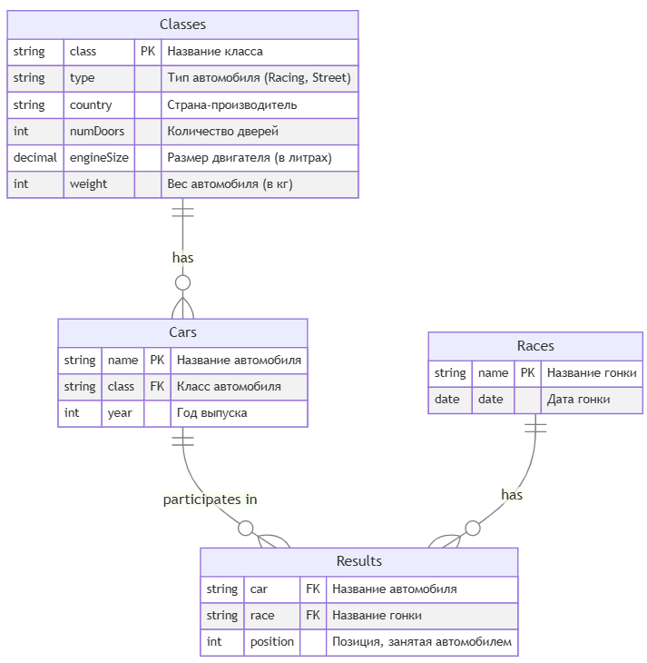

## 1. Структура базы данных

### 1.1 Схема таблиц

## 1. Структура базы данных



В данной схеме:
- **Classes** — хранит информацию о классах автомобилей: тип, страну, двигатель и т.п.
- **Cars** ссылается на Classes по полю `class` (внешний ключ).
- **Races** хранит гонки и их даты.
- **Results** связывает таблицы Cars и Races через результаты (позиции, занятые конкретным автомобилем в гонке).

### 1.2 Скрипты создания таблиц

#### **MySQL**

```sql
-- Создание таблицы Classes
CREATE TABLE Classes (
    class VARCHAR(100) NOT NULL,
    type ENUM('Racing', 'Street') NOT NULL,
    country VARCHAR(100) NOT NULL,
    numDoors INT NOT NULL,
    engineSize DECIMAL(3, 1) NOT NULL,  -- размер двигателя в литрах
    weight INT NOT NULL,               -- вес автомобиля (кг)
    PRIMARY KEY (class)
);

-- Создание таблицы Cars
CREATE TABLE Cars (
    name VARCHAR(100) NOT NULL,
    class VARCHAR(100) NOT NULL,
    year INT NOT NULL,
    PRIMARY KEY (name),
    FOREIGN KEY (class) REFERENCES Classes(class)
);

-- Создание таблицы Races
CREATE TABLE Races (
    name VARCHAR(100) NOT NULL,
    date DATE NOT NULL,
    PRIMARY KEY (name)
);

-- Создание таблицы Results
CREATE TABLE Results (
    car VARCHAR(100) NOT NULL,
    race VARCHAR(100) NOT NULL,
    position INT NOT NULL,
    PRIMARY KEY (car, race),
    FOREIGN KEY (car) REFERENCES Cars(name),
    FOREIGN KEY (race) REFERENCES Races(name)
);
```

#### **PostgreSQL**

```sql
-- Создание таблицы Classes
CREATE TABLE Classes (
    class VARCHAR(100) NOT NULL,
    type VARCHAR(20) NOT NULL CHECK (type IN ('Racing', 'Street')),
    country VARCHAR(100) NOT NULL,
    numDoors INT NOT NULL,
    engineSize DECIMAL(3, 1) NOT NULL,
    weight INT NOT NULL,
    PRIMARY KEY (class)
);

-- Создание таблицы Cars
CREATE TABLE Cars (
    name VARCHAR(100) NOT NULL,
    class VARCHAR(100) NOT NULL,
    year INT NOT NULL,
    PRIMARY KEY (name),
    FOREIGN KEY (class) REFERENCES Classes(class)
);

-- Создание таблицы Races
CREATE TABLE Races (
    name VARCHAR(100) NOT NULL,
    date DATE NOT NULL,
    PRIMARY KEY (name)
);

-- Создание таблицы Results
CREATE TABLE Results (
    car VARCHAR(100) NOT NULL,
    race VARCHAR(100) NOT NULL,
    position INT NOT NULL,
    PRIMARY KEY (car, race),
    FOREIGN KEY (car) REFERENCES Cars(name),
    FOREIGN KEY (race) REFERENCES Races(name)
);
```

## 2. Наполнение базы тестовыми данными

```sql
-- Вставка данных в таблицу Classes
INSERT INTO Classes (class, type, country, numDoors, engineSize, weight) VALUES
('SportsCar', 'Racing', 'USA', 2, 3.5, 1500),
('Sedan', 'Street', 'Germany', 4, 2.0, 1200),
('SUV', 'Street', 'Japan', 4, 2.5, 1800),
('Hatchback', 'Street', 'France', 5, 1.6, 1100),
('Convertible', 'Racing', 'Italy', 2, 3.0, 1300),
('Coupe', 'Street', 'USA', 2, 2.5, 1400),
('Luxury Sedan', 'Street', 'Germany', 4, 3.0, 1600),
('Pickup', 'Street', 'USA', 2, 2.8, 2000);

-- Вставка данных в таблицу Cars
INSERT INTO Cars (name, class, year) VALUES
('Ford Mustang', 'SportsCar', 2020),
('BMW 3 Series', 'Sedan', 2019),
('Toyota RAV4', 'SUV', 2021),
('Renault Clio', 'Hatchback', 2020),
('Ferrari 488', 'Convertible', 2019),
('Chevrolet Camaro', 'Coupe', 2021),
('Mercedes-Benz S-Class', 'Luxury Sedan', 2022),
('Ford F-150', 'Pickup', 2021),
('Audi A4', 'Sedan', 2018),
('Nissan Rogue', 'SUV', 2020);

-- Вставка данных в таблицу Races
INSERT INTO Races (name, date) VALUES
('Indy 500', '2023-05-28'),
('Le Mans', '2023-06-10'),
('Monaco Grand Prix', '2023-05-28'),
('Daytona 500', '2023-02-19'),
('Spa 24 Hours', '2023-07-29'),
('Bathurst 1000', '2023-10-08'),
('Nürburgring 24 Hours', '2023-06-17'),
('Pikes Peak International Hill Climb', '2023-06-25');

-- Вставка данных в таблицу Results
INSERT INTO Results (car, race, position) VALUES
('Ford Mustang', 'Indy 500', 1),
('BMW 3 Series', 'Le Mans', 3),
('Toyota RAV4', 'Monaco Grand Prix', 2),
('Renault Clio', 'Daytona 500', 5),
('Ferrari 488', 'Le Mans', 1),
('Chevrolet Camaro', 'Monaco Grand Prix', 4),
('Mercedes-Benz S-Class', 'Spa 24 Hours', 2),
('Ford F-150', 'Bathurst 1000', 6),
('Audi A4', 'Nürburgring 24 Hours', 8),
('Nissan Rogue', 'Pikes Peak International Hill Climb', 3);
```

## 3. Задания

### Задача 1

**Условие:**
> Определить, какие автомобили из **каждого класса** имеют **наименьшую среднюю позицию** в гонках,  
> вывести:
> - `car_name` (имя автомобиля)
> - `car_class` (класс)
> - `average_position` (средняя позиция)
> - `race_count` (сколько гонок у этого авто)  
    > Отсортировать по `average_position`.

**Пример решения (MySQL)**

```sql
SELECT 
    x.car_name,
    x.car_class,
    x.avg_position,
    x.race_count
FROM 
  (
    /* #1: сгруппируем каждую машину и посчитаем avg() и COUNT() */
    SELECT 
       c.name AS car_name,
       c.class AS car_class,
       AVG(r.position) AS avg_position,
       COUNT(*) AS race_count
    FROM Cars c
    JOIN Results r ON c.name = r.car
    GROUP BY c.class, c.name
  ) AS x
JOIN 
  (
    /* #2: для каждого класса найдём min(avg_position) */
    SELECT 
       c.class AS car_class,
       MIN(sub.avg_position) AS min_avg_pos
    FROM 
      (
        SELECT 
          c.class,
          AVG(r.position) AS avg_position
        FROM Cars c
        JOIN Results r ON c.name = r.car
        GROUP BY c.class, c.name
      ) AS sub
    GROUP BY sub.class
  ) AS y
  ON x.car_class = y.car_class
     AND x.avg_position = y.min_avg_pos
ORDER BY x.avg_position;
```

**Ожидаемый вывод** (по тестовым данным):

```
car_name               car_class      average_position   race_count
--------------------   ------------   ----------------   ----------
Ferrari 488            Convertible    1.0000            1
Ford Mustang           SportsCar      1.0000            1
Toyota RAV4            SUV            2.0000            1
Mercedes-Benz S-Class  Luxury Sedan   2.0000            1
BMW 3 Series           Sedan          3.0000            1
Chevrolet Camaro       Coupe          4.0000            1
Renault Clio           Hatchback      5.0000            1
Ford F-150             Pickup         6.0000            1
```

---

### Задача 2

**Условие:**
> Определить один автомобиль, который имеет **наименьшую** среднюю позицию среди _всех_ автомобилей. Если их несколько, брать **по алфавиту** (имя авто). Вывести:
> - `car_name`
> - `car_class`
> - `average_position`
> - `race_count`
> - `car_country` (страна производства класса автомобиля)
>
> «Один» автомобиль в итоге.

**Идея решения:**
1. Для каждого автомобиля считаем `AVG(position)`.
2. Находим минимальное `avg_position`; при равенстве — самое маленькое `car_name`.
3. Присоединяем таблицу `Classes` (через `Cars.class`), чтобы вывести `country`.

**Пример решения (MySQL)**

```sql
SELECT 
    z.car_name,
    z.car_class,
    z.avg_position,
    z.race_count,
    cl.country AS car_country
FROM
(
  /* Подзапрос: все авто, их средняя позиция и кол-во гонок */
  SELECT
    c.name AS car_name,
    c.class AS car_class,
    AVG(r.position) AS avg_position,
    COUNT(*) AS race_count
  FROM Cars c
  JOIN Results r ON c.name = r.car
  GROUP BY c.name
) AS z
JOIN Classes cl ON cl.class = z.car_class
WHERE (z.avg_position, z.car_name) =
 (
   /* Вложенный запрос: берём одну строку с минимальным avg, а при равенстве — алфавит */
   SELECT t.avg_position, t.car_name
   FROM
   (
     SELECT
       c.name AS car_name,
       AVG(r.position) AS avg_position
     FROM Cars c
     JOIN Results r ON c.name = r.car
     GROUP BY c.name
     ORDER BY avg_position ASC, car_name ASC
     LIMIT 1
   ) AS t
 )
;
```

**Ожидаемый вывод**:
```
car_name      car_class      average_position  race_count  car_country
------------  ------------   ----------------  ----------  -----------
Ferrari 488   Convertible    1.0000           1           Italy
```

---

### Задача 3

**Условие:**
> Определить **классы** автомобилей, имеющие **наименьшую** _общую_ среднюю позицию (среди всех классов). Если несколько классов делят один и тот же минимум, выбрать их все. Затем вывести **каждый автомобиль** из этих «победных» классов с полями:
> - `car_name`
> - `car_class`
> - `average_position`
> - `race_count`
> - `car_country`
> - `total_races` — общее **число гонок** (или суммарное кол-во участий) в данном классе.

**Пример решения (MySQL)**

```sql
SELECT
   car_info.car_name,
   car_info.car_class,
   car_info.avg_position,
   car_info.race_count,
   cl.country AS car_country,
   class_stat.total_races
FROM
(
  /* #1: Для каждой машины считаем avg_position, race_count */
  SELECT
    c.name AS car_name,
    c.class AS car_class,
    AVG(r.position) AS avg_position,
    COUNT(*) AS race_count
  FROM Cars c
  JOIN Results r ON c.name = r.car
  GROUP BY c.name
) AS car_info

JOIN
(
  /* #2: Для каждого класса считаем 
        - class_avg_position, 
        - total_races (сколько всего гонок у машин этого класса) */
  SELECT
    c.class AS car_class,
    AVG(r.position) AS class_avg_position,
    COUNT(*) AS total_races
  FROM Cars c
  JOIN Results r ON c.name = r.car
  GROUP BY c.class
) AS class_stat
  ON car_info.car_class = class_stat.car_class

JOIN Classes cl ON cl.class = car_info.car_class

/* Оставляем только классы, у которых class_avg_position = MIN(...) */
WHERE class_stat.class_avg_position IN
 (
   SELECT MIN(sub.class_avg_position)
   FROM
   (
     SELECT
       c.class,
       AVG(r.position) AS class_avg_position
     FROM Cars c
     JOIN Results r ON c.name = r.car
     GROUP BY c.class
   ) AS sub
 )
ORDER BY car_info.avg_position;
```

**Ожидаемый вывод**:
```
car_name       car_class      average_position  race_count  car_country   total_races
-------------  ------------   ---------------   ----------  -----------   -----------
Ferrari 488    Convertible    1.0000           1           Italy         1
Ford Mustang   SportsCar      1.0000           1           USA           1
```

---

### Задача 4

**Условие:**
> Определить автомобили, у которых средняя позиция «лучше» (меньше), чем средняя позиция **всех** автомобилей в этом же классе.  
> При этом в классе должно быть **минимум два** автомобиля (чтобы было с чем сравнить).  
> Вывести:
> - `car_name`
> - `car_class`
> - `average_position`
> - `race_count`
> - `car_country`  
    > Отсортировать по `car_class` и затем по `average_position` (возрастание).

**Пример решения (MySQL)**

```sql
SELECT
  car_stats.car_name,
  car_stats.car_class,
  car_stats.avg_position,
  car_stats.race_count,
  cl.country AS car_country
FROM
(
  /* #1: avg_position для каждой машины */
  SELECT
    c.name AS car_name,
    c.class AS car_class,
    AVG(r.position) AS avg_position,
    COUNT(*) AS race_count
  FROM Cars c
  JOIN Results r ON c.name = r.car
  GROUP BY c.name
) AS car_stats

JOIN
(
  /* #2: средняя позиция по классу + общее число машин в классе */
  SELECT
    cl.class AS car_class,
    AVG(r.position) AS class_avg_position,
    COUNT(DISTINCT c.name) AS car_count_in_class
  FROM Cars c
  JOIN Results r ON r.car = c.name
  JOIN Classes cl ON cl.class = c.class
  GROUP BY cl.class
) AS class_info
  ON car_stats.car_class = class_info.car_class

JOIN Classes cl ON cl.class = car_stats.car_class

WHERE class_info.car_count_in_class >= 2
  AND car_stats.avg_position < class_info.class_avg_position
ORDER BY car_stats.car_class,
         car_stats.avg_position;
```

**Ожидаемый вывод**:
```
car_name        car_class   average_position   race_count   car_country
--------------  ----------  ----------------   ----------   -----------
BMW 3 Series    Sedan       3.0                1            Germany
Toyota RAV4     SUV         2.0000             1            Japan
```

---

### Задача 5

**Условие:**
> Определить, какие классы имеют **наибольшее** число автомобилей с **низкой** средней позицией (`> 3.0`), назовём это `low_position_count`.  
> Далее вывести **каждый автомобиль** (у которого avg_position > 3.0) из таких классов, с полями:
> - `car_name`
> - `car_class`
> - `average_position`
> - `race_count`
> - `car_country`
> - `total_races` (число гонок для класса; при необходимости можно считать `COUNT(DISTINCT r.race)` вместо `COUNT(*)`)
> - `low_position_count` (сколько в данном классе таких «низких» авто).  
    > Отсортировать по убыванию `low_position_count`. Если несколько классов делят одинаковый max, выводим их все.

**Пример решения (MySQL)**

```sql
SELECT
   cs.car_name,
   cs.car_class,
   cs.avg_position,
   cs.race_count,
   cl.country AS car_country,
   class_stat.total_races,
   class_stat.low_position_count
FROM
(
  /* #1: Для каждой машины считаем avg_position и отмечаем is_low = 1, если avg>3 */
  SELECT
    c.name AS car_name,
    c.class AS car_class,
    AVG(r.position) AS avg_position,
    COUNT(*) AS race_count,
    CASE WHEN AVG(r.position) > 3.0 THEN 1 ELSE 0 END AS is_low
  FROM Cars c
  JOIN Results r ON c.name = r.car
  GROUP BY c.name
) AS cs

JOIN
(
  /* #2: Для каждого класса суммируем количество low-машин, считаем total_races */
  SELECT
    c.class AS car_class,
    SUM(CASE WHEN avg_tbl.avg_pos > 3.0 THEN 1 ELSE 0 END) AS low_position_count,
    COUNT(*) AS total_races  /* либо COUNT(DISTINCT r.race) - зависит от трактовки */
  FROM
   /* Подзапрос для вычисления avg_pos по каждой машине */
   (
     SELECT c1.name AS car_name,
            c1.class AS car_class,
            AVG(r1.position) AS avg_pos
     FROM Cars c1
     JOIN Results r1 ON c1.name = r1.car
     GROUP BY c1.name
   ) AS avg_tbl
  JOIN Cars c ON c.name = avg_tbl.car_name
  JOIN Results r ON r.car = c.name
  GROUP BY c.class
) AS class_stat
  ON cs.car_class = class_stat.car_class

JOIN Classes cl ON cl.class = cs.car_class

WHERE class_stat.low_position_count IN
 (
   /* Определяем, у кого самое большое 'low_position_count' */
   SELECT MAX(x.low_position_count)
   FROM 
   (
     SELECT
       c.class AS car_class,
       SUM(CASE WHEN t.avg_pos > 3.0 THEN 1 ELSE 0 END) AS low_position_count
     FROM
     (
       SELECT c2.name, c2.class, AVG(r2.position) AS avg_pos
       FROM Cars c2
       JOIN Results r2 ON c2.name = r2.car
       GROUP BY c2.name
     ) AS t
     JOIN Cars c ON c.name = t.name
     GROUP BY c.class
   ) AS x
 )
AND cs.is_low = 1  /* берём только машины, у которых avg_position>3 */
ORDER BY class_stat.low_position_count DESC;
```

**Ожидаемый вывод**:
```
car_name          car_class      avg_position  race_count  car_country  total_races  low_position_count
----------------  -------------  ------------  ----------  -----------  -----------  ------------------
Audi A4           Sedan          8.0000        1           Germany      2            2
Chevrolet Camaro  Coupe          4.0000        1           USA          1            1
Renault Clio      Hatchback      5.0000        1           France       1            1
Ford F-150        Pickup         6.0000        1           USA          1            1
```

---
